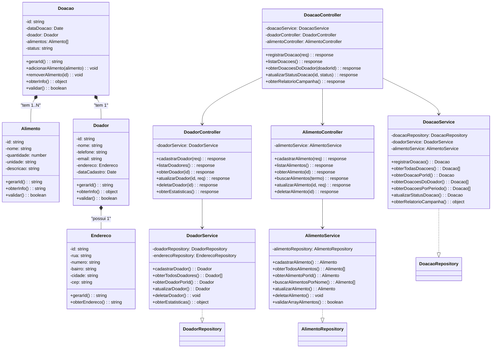

# 📊 Diagrama UML - Panela Solidária

## Arquitetura em Camadas e Relacionamentos

Este documento apresenta o diagrama UML do sistema "Panela Solidária" que ilustra as entidades, seus atributos e relacionamentos.

---

## 1. Diagrama de Classes (Mermaid)



---

## 2. Relacionamentos Detalhados

### 2.1 Relacionamento: Doador ↔ Endereço

```
┌─────────────────────────┐
│      DOADOR             │
├─────────────────────────┤
│ - id: string            │
│ - nome: string          │
│ - telefone: string      │
│ - email: string         │
│ - endereco: Endereco    │ ────┐
│ - dataCadastro: Date    │     │
├─────────────────────────┤     │ "possui 1"
│ + validar()             │     │
│ + obterInfo()           │     │
└─────────────────────────┘     │
                                 │
                                 ↓
                        ┌─────────────────────────┐
                        │     ENDEREÇO            │
                        ├─────────────────────────┤
                        │ - id: string            │
                        │ - rua: string           │
                        │ - numero: string        │
                        │ - bairro: string        │
                        │ - cidade: string        │
                        │ - cep: string           │
                        ├─────────────────────────┤
                        │ + obterEndereco()       │
                        └─────────────────────────┘

Cardinalidade: 1 para 1 (Um doador possui um endereço)
Tipo: Composição
Multiplicidade: Doador (1) → Endereço (1)
```

### 2.2 Relacionamento: Doador ↔ Doação

```
┌─────────────────────────┐
│      DOADOR             │
├─────────────────────────┤
│ - id: string            │
│ - nome: string          │
│ - ...                   │ ───┐
├─────────────────────────┤    │
│ + validar()             │    │ "realiza 1..N"
│ + obterInfo()           │    │
└─────────────────────────┘    │
                                ↓
                        ┌─────────────────────────┐
                        │     DOAÇÃO              │
                        ├─────────────────────────┤
                        │ - id: string            │
                        │ - dataDoacao: Date      │
                        │ - doador: Doador        │
                        │ - alimentos: []         │
                        │ - status: string        │
                        ├─────────────────────────┤
                        │ + registrar()           │
                        │ + obterInfo()           │
                        └─────────────────────────┘

Cardinalidade: 1 para N (Um doador pode realizar várias doações)
Tipo: Agregação
Multiplicidade: Doador (1) ← Doação (0..N)
```

### 2.3 Relacionamento: Doação ↔ Alimento

```
┌─────────────────────────┐
│     DOAÇÃO              │
├─────────────────────────┤
│ - id: string            │
│ - dataDoacao: Date      │
│ - doador: Doador        │
│ - alimentos: []         │ ───┐
│ - status: string        │    │ "possui 1..N"
├─────────────────────────┤    │
│ + adicionarAlimento()   │    │
│ + removerAlimento()     │    │
│ + validar()             │    │
└─────────────────────────┘    │
                                ↓
                        ┌─────────────────────────┐
                        │    ALIMENTO             │
                        ├─────────────────────────┤
                        │ - id: string            │
                        │ - nome: string          │
                        │ - quantidade: number    │
                        │ - unidade: string       │
                        │ - descricao: string     │
                        ├─────────────────────────┤
                        │ + obterInfo()           │
                        │ + validar()             │
                        └─────────────────────────┘

Cardinalidade: 1 para N (Uma doação possui vários alimentos)
Tipo: Agregação
Multiplicidade: Doação (1) ← Alimento (1..N)
```

---

## 3. Fluxo de Dados - Arquitetura em Camadas

```
┌────────────────────────────────────────────────────────────────┐
│                     INTERFACE DO USUÁRIO                       │
│              (Frontend - HTML, CSS, JavaScript)                │
└────────────────────────────────────────────────────────────────┘
                              ↓
┌────────────────────────────────────────────────────────────────┐
│                     CAMADA CONTROLLERS                         │
│  DoadorController → AlimentoController → DoacaoController     │
│     (Recebem requisições, validam entrada)                    │
└────────────────────────────────────────────────────────────────┘
                              ↓
┌────────────────────────────────────────────────────────────────┐
│                     CAMADA SERVICES                            │
│   DoadorService → AlimentoService → DoacaoService             │
│   (Implementam regras de negócio, coordenam com repositories) │
└────────────────────────────────────────────────────────────────┘
                              ↓
┌────────────────────────────────────────────────────────────────┐
│                   CAMADA REPOSITORIES                          │
│ DoadorRepository → AlimentoRepository → DoacaoRepository      │
│      (Gerenciam persistência de dados - localStorage)         │
└────────────────────────────────────────────────────────────────┘
                              ↓
┌────────────────────────────────────────────────────────────────┐
│                    CAMADA MODELS                               │
│     Doador → Alimento → Doacao → Endereco                     │
│           (Representam as entidades)                           │
└────────────────────────────────────────────────────────────────┘
                              ↓
┌────────────────────────────────────────────────────────────────┐
│                   ARMAZENAMENTO DE DADOS                       │
│                  (localStorage do navegador)                   │
└────────────────────────────────────────────────────────────────┘
```

---

## 4. Exemplo de Fluxo Completo: Registrar uma Doação

```
PASSO 1: Usuário clica em "Registrar Doação"
         ↓
         └─→ app.js (JavaScript da interface)

PASSO 2: Validação inicial da entrada
         ↓
         └─→ DoacaoController.registrarDoacao(req)

PASSO 3: Aplicação de regras de negócio
         ↓
         └─→ DoacaoService.registrarDoacao()
             - Valida doador existe
             - Valida alimentos exist e são válidos
             - Cria objeto Doacao

PASSO 4: Persistência de dados
         ↓
         └─→ DoacaoRepository.salvar(doacao)
             - Serializa objeto para JSON
             - Armazena em localStorage

PASSO 5: Retorno ao usuário
         ↓
         └─→ Controllers retorna resposta formatada
             - sucesso: true/false
             - mensagem: string
             - dados: object

PASSO 6: Atualização da interface
         ↓
         └─→ JavaScript atualiza o DOM com resultado
```

---

## 5. Matriz de Relacionamentos

| Classe | Relacionamento | Classe | Cardinalidade | Tipo |
|--------|---|---|---|---|
| Doador | possui | Endereço | 1:1 | Composição |
| Doador | realiza | Doação | 1:N | Agregação |
| Doação | contém | Alimento | 1:N | Agregação |
| DoadorController | usa | DoadorService | 1:1 | Associação |
| AlimentoController | usa | AlimentoService | 1:1 | Associação |
| DoacaoController | usa | DoacaoService | 1:1 | Associação |
| DoadorService | usa | DoadorRepository | 1:1 | Associação |
| AlimentoService | usa | AlimentoRepository | 1:1 | Associação |
| DoacaoService | usa | DoacaoRepository | 1:1 | Associação |

---

## 6. Regras de Negócio Implementadas

### 6.1 Regras de Doador
- ✓ Um doador deve ter email único no sistema
- ✓ Todos os campos do doador são obrigatórios (nome, telefone, email, endereço)
- ✓ Um doador deve ter um endereço válido
- ✓ Um doador pode realizar 0 ou N doações

### 6.2 Regras de Alimento
- ✓ Nome do alimento é obrigatório
- ✓ Quantidade deve ser > 0
- ✓ Unidade de medida é obrigatória
- ✓ Múltiplos alimentos podem estar em uma doação

### 6.3 Regras de Doação
- ✓ Uma doação deve ter um doador válido
- ✓ Uma doação deve ter pelo menos 1 alimento
- ✓ Status pode ser: registrada, recebida ou entregue
- ✓ A doação herda informações do doador e dos alimentos

### 6.4 Regras de Endereço
- ✓ Endereço é único por doador
- ✓ Todos os campos de endereço são obrigatórios
- ✓ Endereço pode ser compartilhado entre doadores (em cenários futuros)

---

## 7. Estrutura de Diretórios

```
src/
├── index.js                              # Arquivo principal - demonstração
├── models/
│   ├── Doador.js                        # Model: Doador
│   ├── Alimento.js                      # Model: Alimento
│   ├── Doacao.js                        # Model: Doação
│   └── Endereco.js                      # Model: Endereço
├── repositories/
│   ├── DoadorRepository.js              # Repository: Doador
│   ├── AlimentoRepository.js            # Repository: Alimento
│   ├── DoacaoRepository.js              # Repository: Doação
│   └── EnderecoRepository.js            # Repository: Endereço
├── services/
│   ├── DoadorService.js                 # Service: Doador
│   ├── AlimentoService.js               # Service: Alimento
│   └── DoacaoService.js                 # Service: Doação
├── controllers/
│   ├── DoadorController.js              # Controller: Doador
│   ├── AlimentoController.js            # Controller: Alimento
│   └── DoacaoController.js              # Controller: Doação
└── public/
    ├── index.html                       # Landing page
    ├── css/
    │   └── style.css                    # Estilos CSS
    └── js/
        └── app.js                       # Lógica da aplicação
```

---

## 8. Persistência de Dados

O sistema utiliza **localStorage** do navegador para persistir dados entre sessões.

### Chaves de Armazenamento:
- `doadores_storage`: Array de Doadores
- `enderecos_storage`: Array de Endereços
- `alimentos_storage`: Array de Alimentos
- `doacoes_storage`: Array de Doações

### Exemplo de Estrutura JSON:
```json
{
  "doadores_storage": [
    {
      "id": "doador_1692374892521_abc123def",
      "nome": "João Silva",
      "telefone": "(11) 98765-4321",
      "email": "joao@email.com",
      "endereco": {
        "id": "end_1692374892521_xyz789",
        "rua": "Rua das Flores",
        "numero": "123",
        "bairro": "Centro",
        "cidade": "São Paulo",
        "cep": "01000-000"
      },
      "dataCadastro": "2024-08-18T10:30:00.000Z"
    }
  ],
  "doacoes_storage": [
    {
      "id": "doacao_1692374965123_def456",
      "dataDoacao": "2024-08-18T10:35:00.000Z",
      "doador": { /* Objeto completo do Doador */ },
      "alimentos": [ /* Array de alimentos */ ],
      "status": "registrada"
    }
  ]
}
```

---

## 9. Funcionalidades Implementadas

✓ Cadastro de Doadores com endereço
✓ Cadastro de Alimentos
✓ Registro de Doações
✓ Relacionamento entre Doador e Doação
✓ Relacionamento entre Doação e Alimentos
✓ Visualização de Doações
✓ Atualização de Status de Doações
✓ Relatório consolidado da campanha
✓ Validações de dados em todas as camadas
✓ Armazenamento persistente de dados

---

## 10. Conclusão

Este diagrama UML e a arquitetura em camadas implementada demonstram:

1. **Separação de Responsabilidades**: Cada camada tem uma função específica
2. **Reusabilidade**: Componentes podem ser reutilizados em diferentes contextos
3. **Manutenibilidade**: Alterações em uma camada não afetam outras
4. **Escalabilidade**: Fácil adicionar novas funcionalidades
5. **Testabilidade**: Cada componente pode ser testado isoladamente

A arquitetura segue o padrão **MVC (Model-View-Controller)** com separação adicional da lógica de negócio em **Services** e do acesso a dados em **Repositories**.
